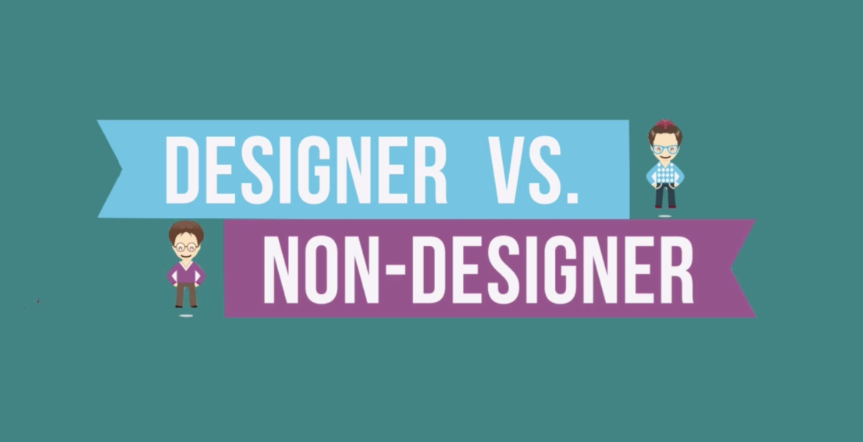
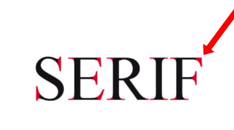
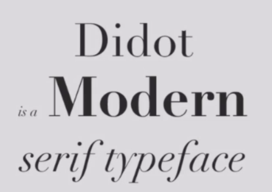
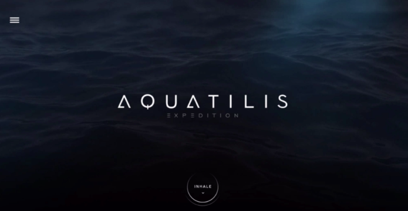

# Designer VS. Non Designer

## Color: different color has different mood. 

 
## Typography

## Colour Theory

* Mood
* red, yellow, green, blue, purple.

# how to combinecolours to create colour Palettes.

* color wheel

* Analogous Colour Palettes. use adjason color to create harmonous. 

* Complementary Colors
: for attention grabing. 

* split colours: less clashing still grab attention. 

* Tradic Colours:
balance, and grab the attention. But was overused in 90's in ads design. 

* Monochromatic
same color with more white or black to create different tones and shades that stands to each others. 

## Tools for Designing with colors. 
 
 * ColorHunt <a href="https://colorhunt.co/">more</a>

 * FlatUIColors(for iOS)
 <a href="https://flatuicolors.com">more</a>
 
 * MaterialPalette(for Android)
  <a href="https://www.materialpalette.com/">more</a>

  * ColorZilla get the color from browser. 

  * use these tools to create own color palettes for app projects. 

# Introduction to Typography

* Serif typeface has tiny little feet for stone carving in acient days. 
More traditional and conservative for serious things.

* old style

* transational font

* modern font

* Slab-Sarif, no different between thickness for news paper printing. 

## The San-Serif Type Family - Origin and Use

* San-Serif:
not tiny feet.

* Grotesque, Neo-Grotesque, Humanist, Geometric. 

## How  typography Determines Readability

* why typyface matters?

## How to combine Fonts like Pro

* Common rules for designer. 

1. Serif and Sans-Serif workds well. Heading uses Serif typefaces and body use Sans-Serif that turns to be good design. 

2. Sans-Serif & Serif. Create contract. 

3. Don't Do this. mix Serif with Serif, or Sans-Serif with Sans-Serif. 

4. two different fonts make design good. Too many fonts is not a good things.
 

* the United Fonts of America

5. Don't mix Different Moods

6. Similar the mood with typeface. The time era with the typeface. 
Make constrast with the Serif-ness and Weights. 

7. never use these fonts. 

* tools to use: 

1. WhatFont: goold chrome extension.  
2. FontSQUIRREL 
<a href="https://www.fontsquirrel.com/">more</a>
3. Sky Fonts: mac app. 
<a href="https://www.jotform.com/blog/skyfonts-the-best-way-to-use-google-fonts-on-your-desktop-76799/">more</a>

#  UI Design

## The Tour Guide Approach to UI Design

1. If an App was a Journey

our attentions is always drawn from the bigest the boldest the brightest thing first. 

* Web Design in 4 Minutes
<a href="https://jgthms.com/web-design-in-4-minutes/">more</a>

2. How to pretend you have a designer.
* minimize the number of alignment line. 

two type of alignment. 
* Edge Alignment

* Centre Alignment

**pay attention to edge alignment.** 

3. How to Get more Clickthrough. What is good practice in interaction Design. 

* add border.
* add gradient.
* add show border and image. 

materialize the content. 

4. How to Design if you know nothing. 

Color in User Interface Design.

Always start with simplisity. 
Check dribble. 
<a href="https://dribbble.com/">more</a>

find collections by search hex color. 

5. Make Text Visible on Image. 

The many ways of designing text overlays.

use block background to make text visible. 

adjust the backgroud color. 

add a color overlay. 

use gaussian blur. add contrast between blur image and sharp text. or use blur partially. 

6. How to be an attention Architect. 

* use text: large or small.
* make bolder, brighter, and color. 
* use typeface with a heavy weighting vs thin or light. Or you can capitalize or lowercase the words. 
* use italic
* increasing the distance. 

created by LemonHoney with Love and Hope.

 

