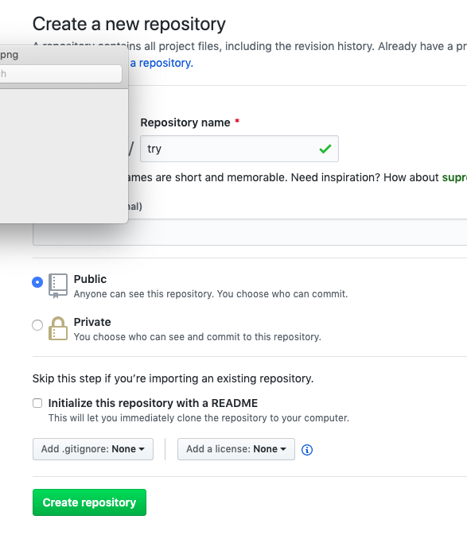

# 【保姆级服务】用Git 以及 Github 管理工作报告

自从开始接触coding， 发觉了一个超级好用的工具， git和github。 对于常人（非coding人士）而言，这也是一个很好用的工具， 帮助自己管理好文件。 不管是大学写论文还是公司写报告，很多时候来来回回修改， 从final01一直可以修改到final99. git可以记录并且追溯修改记录，这样任何时候都能如穿越时光一般回到原先版本。 

So， 废话不多说直接上路。 

1. 开始之前，有几个必备条件（MAC使用环境为例）
  * 基本要求是会用command line，就是在terminal里打字。 
  * 已经安装git， 自行搜索
  [git](https://git-scm.com/)官网安装,配置过程也有很多[教程](https://www.runoob.com/git/git-install-setup.html)可以使用.
  * 注册[GitHub](https://github.com)。

2. 打开terminal，确认在根目录下状态， “～”在名字前。 输入下面语句。 cd 表示change directory,之后把目标路径加上去。 
```
cd Users/lemonhoney/folder1
```
enter之后加入之后的语句, 添加txt文件。
```
touch file.txt
```
打开新建文件，可以尝试在里面添加内容。
```
open file.txt
```
3. 启动git，把文件添加到本地git中。在terminal中输入如下语句
```
git init
```
按下回车后， 继续添加, .前面需要添加空格。
```
git add .
```
最后commit一下, comments可以是自己写的备注了，
```
git commit -m "comments"
```

4. push到远程github中去，这样就可以把文件放在云端了。 可以选择公开或者不公开信息，readme也是随意。 

在github中创建新的repository, 如图




一路创建之后， 就得到这个界面。 

这里我们使用第二种办法。 同样在本地MAC的terminal里面输入语句。 记得没输入一行按enter， 看到自己用户名出现再继续。 

到这里就可以把文件上传到github了。 


