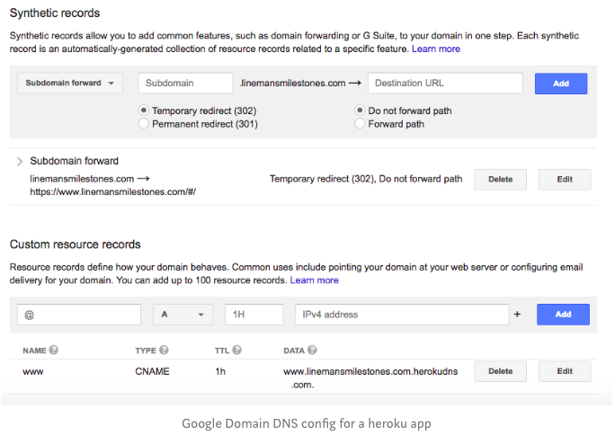

# 【柠檬保姆级别教程---写给未来的自己】使用node.je+Heroku+google domain 同时添加SSL 20分钟网站部署  一站式教程

为了把网站对应到指定的域名，我至少花了三四个小时来解决这个问题。写这个教程，是为了方便以后的自己T-T。 

有时候在coding遇到一个环节被卡住，是很痛苦的，如果你也被同样的问题所困扰，搞得茶饭不思的时候，希望这篇教程可以帮到你，不管如何coding不是生活的全部，要相信问题总会找到解决方法， 生命除了coding还有爱和希望，出门走走透透气，和朋友家人呆在一起共度美好时光。 


目前用node.js写了一个app， 用heroku来host，同时指向google domain的域名，外加SSL证书。 总共费用也就是$12 一年的域名费用和免费的SSL认证。 对于小项目还是很划算的。 直接进入教程：

前期准备， 必要技能： 
    
1. 会用terminal 不会的话复制黏贴也行。 
2. 会用node.js html css...这个基本入门即可。 
3. 会用heroku 注册登录账号安装, follow 官网教程。 
4. 有*gogle domains*上注册的域名。 也可以是其他域名服务平台，操作会有不同。 

正式开始：

1. 本地网站folder下添加一个文件，名称必须为

 Procfile

 大小写一致，没有后缀名。 打开文件，添加如下语句：

  web: node app.js  

这是让heroku知道你的网页app的启动文件， app.js可以是你自己的文件名字。

2. 在terminal里面依次添加如下语句，每次按回车，等出现自己的用户名就表示指令执行完成。 

```
>cd [project location] //cd /desktop/project

>heroku login// 跳出网页，点确定连接。

>git init//创建git

>git add .//添加所有项目文件到stage

>git commit -m "first commit"//commit添加，并且加上first commit注释。

>heroku create// 创建heroku

>git push heroku master//local git推送到heroku//可以等一下，喝杯咖啡。 

```

到这里就已经把app网页推送到heroku云端了，会有一个连接访问app。 


3. 接下来可以把域名指向自己的app网页了。 


4. 打开 heroku => dashboard 

=> 自己的网页app => 进入setting 

=> 找到costom domain => 输入自己的domain name 

   这里划重点。
   一定要是 www.[yousitename].com


    千万不要把www.给漏掉了。我就是因为这一步做错了，导致花了一下午的时间才部署好。 比如可以输入www.mysiteapp.com. mysiteapp是你自己的域名。 .com也是写自己注册的后缀，可以是.io .cc .net


=> 这里会提示verify yourself 需要添加行用卡信息 => verify 之后就可以添加domian name. 之后会有一个字符串给你， 复制下来，这就像是连接domain name的钥匙。 


5. 打开google domains => 点击注册的domain name => 点击左侧选项卡伤的DNS => 需要添加两个信息 按照图示添加
=>  Synthetic Records 

* 选择 Subdomain forward 
在Subdomain方框里输入 @ ， 在Destination URL 输入https//www.yoursiteapp.com. 
（一定要写上https//，这样你的网页app才有SSL认证）

* 下面的选项选Temporary redirect(302), Do not forward path, Enable SSL. 

这样你的网页app的domain name就设定好了， 而且SSL认证也免费添加上去了。


=> 第二个需要添加的是Custom resource records

*第一个方框输入@， 第二个选项选CNAME， 之后一个方框填写刚才复制的字符串。点add。 



6. 回到VS code， 或者自己的terminal。 输入如下语句
```
> cd [project location]
> heroku domains//看看是不是domains指向正确了， 这里需要一些时间， 出去走走再回来。 
> heroku certs: auto refresh//这是更新SSL证书。 会显示需要enable AMC
>heroku ps:resize web=hoppy//enable AMC
>heroku certs:auto:enable
>heroku certs:auto:refresh//从新更新证书
```


完成！！
现在直接在浏览器输入自己的网址，就可以看到自己做的网页或者app了。

生活依旧很美好， coding只是生活中的一部分；coding 让人不断遇到问题， 让人不断学习，这就是coding的乐趣。 


附上修改heroku项目名称的方法 

cd回项目地址， 然后输入如下语句

```
>cd git remote rm heroku
>heroku git:remote -a 刚才新添加的项目名称。 
```

