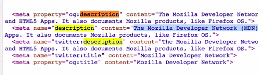
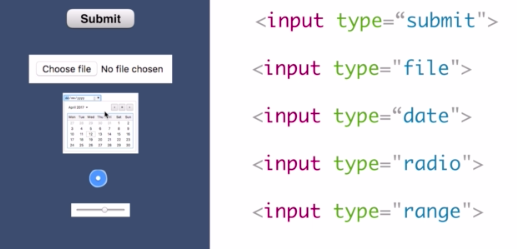
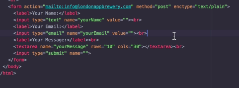

# Lesson 1 HTML #

key note: 
* check the information with DevDocs.io.
* find archive webpage: internet Archive.
* utf-8 is used for HTML5.
unicode-table.com ♡
* meta property can add description. 
* format the html file with right click and find format Document. or shortcut Shft+Opt+F.


* upload image to photobucket. 

* <a download href="htmlcheatsheet.pdf">html cheatsheet. </a>

* to add emoji use shortcut like this: cmd+ctl+space.😜🥳

* <form class="" action="index.html" method="post">
<label> Your Name</label>
<input type="text" name="" value="">

<input type="color" name="" value="">

<input type="submit" name=""> 
<input type="checkbox" name="" value="">
<input type="password" name="" value="">
</form>

```
<form class="" action="index.html" method="post">
<label> Your Name</label>
<input type="text" name="" value="">

<input type="color" name="" value="">

<input type="submit" name=""> </form>
```


* <textarea name="" rows="8" col="80"></textarea>

* change action to mailto:

<form class="" action="mailto:here@gmail.com" method="post" enctype="text/plain">
<label> Your Name</label>
<input type="text" name="name" value="">

<input type="email" name="email" value="">

<input type="submit" name=""> </form>

```
<form class="" action="mailto:here@gmail.com" method="post" enctype="text/plain">
<label> Your Name</label>
<input type="text" name="name" value="">

<input type="email" name="email" value="">

<input type="submit" name=""> </form>
```



* github page host the webpage. 

# Lesson 2. CSS #